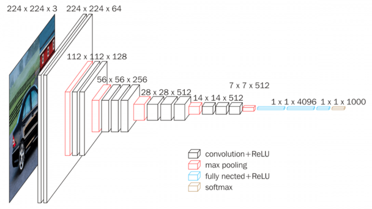

# Software Background

The key questions the software should solve are:

* How to schedule computation to maximize data reuse
* How to extract parallelism to map on your multiple compute units
* How to verify host code operation

These key questions should form the software thesis of your report.

## VGG16 and PyTorch

Our ultimate goal is to accelerate a trained VGG16 model. The architecture is shown below.

VGG16 takes in a $224 \times 224$ pixel RBG image and performs 1000-way [ILSVRC](http://www.image-net.org/) classification. VGG16 has 13 convolutional layers to schedule on your kernel. These convolutional layers are relatively consistent in using $3 \times 3$ kernel-sized filters compared to other kernels which used large ($5 \times 5$ and $11 \times 11$) filter sizes. You have used one VGG model in lab 1 and will need to refer to lab 1 to obtain the validation set and the pre-trained VGG16 model.

## PyTorch C++ Extension

In the final project we will use PyTorch's C++ Extension to add C++ host code to PyTorch. Using C++ extension we will create a custom FPGA `fpga_conv2d` operator.

To implement a custom FPGA `fpga_conv2d` operator using PyTorch's C++ extension, you will will need to do the following steps:

1. Implement the C++ host code operation
2. Specify the build command using C++ Extension
3. Bind C++ functions to Python functions
4. Wrap Python functions with nn.Module and possibly autograd.Function

These steps are covered best by PyTorch examples themselves. You can find one such example [here](https://pytorch.org/tutorials/advanced/cpp_extension.html). This tutorial will not work out of the box for you. You need to make sure that the compile command being used is the same command being ran in your Vitis host code compilation.

### Forward Operation

The forward operation is what is executed when the `fpga_conv2d()` operator is called. The forward operation must

1. Setup OpenCL objects (one time initialization)
2. Cast input tensors to OpenCL arrays
3. Map computation on hardware kernel
4. Cast OpenCL output array to output tensor

Ultimately, this operator should return the same values as nn.conv2d. Prove that your code does this in the report.
